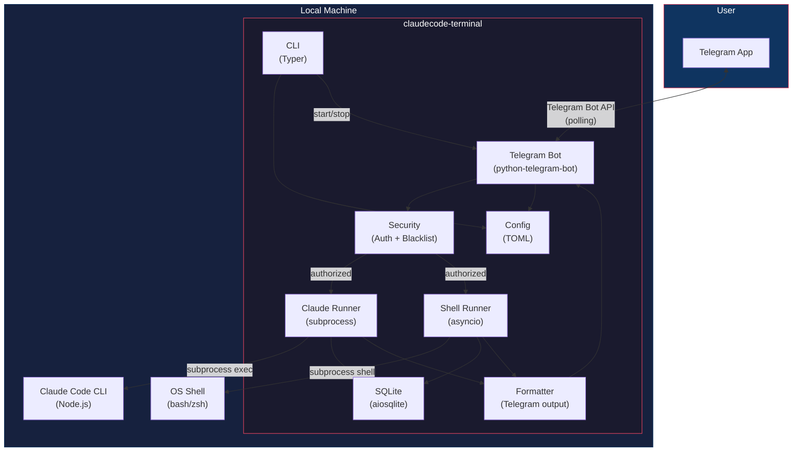
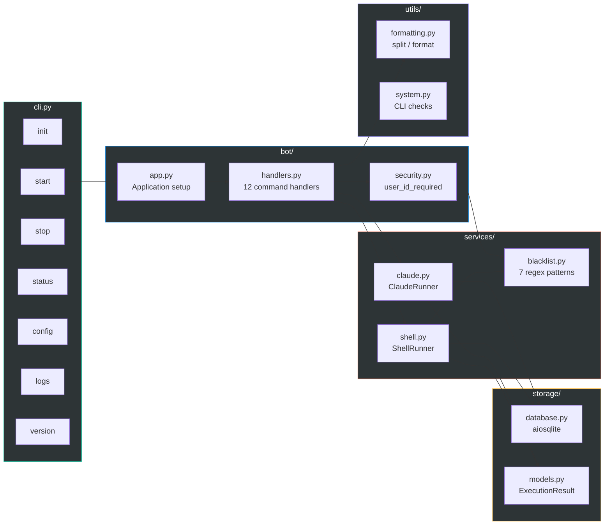
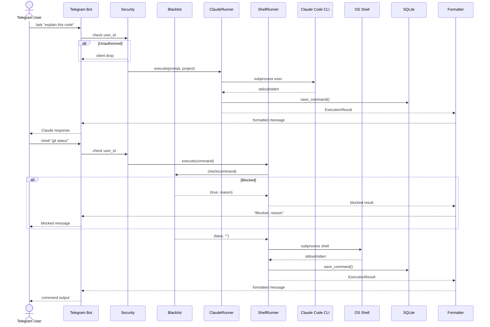
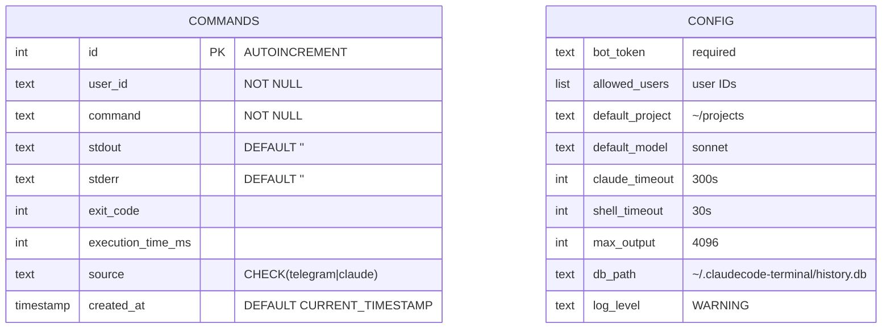
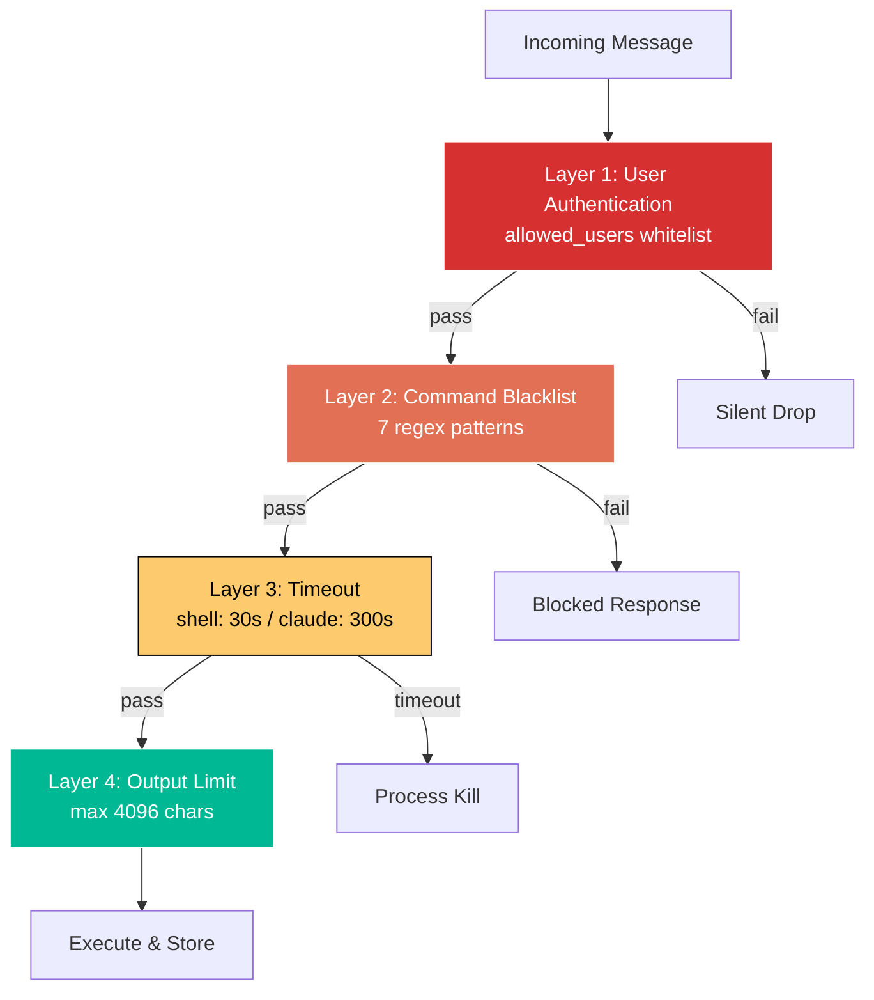

# ClaudeCode Terminal

> Control Claude Code remotely via Telegram.

[](https://python.org)
[](LICENSE)
[](#docker-integration-test)

**[English](README.md)** | [한국어](docs/README.ko.md) | [日本語](docs/README.ja.md) | [中文](docs/README.zh.md)

---

## Architecture

### System Overview



### Module Structure



### Request Flow



### Data Model



### Security Layers



---

## Overview

ClaudeCode Terminal is a personal CLI tool that lets you control [Claude Code](https://docs.anthropic.com/en/docs/claude-code) remotely via Telegram. Send prompts, run shell commands, and manage projects from anywhere through your Telegram bot.

## Features

- **Claude Code Integration** - Send prompts to Claude Code and receive results on Telegram
- **Remote Shell** - Execute shell commands on your local machine via Telegram
- **Security** - User ID whitelist, dangerous command blacklist, execution timeouts
- **Daemon Mode** - Run the bot in the background
- **Command History** - All executions are stored in SQLite
- **Multi-Model** - Switch between Opus, Sonnet, and Haiku models

## Prerequisites

- Python 3.10+
- [Claude Code CLI](https://docs.anthropic.com/en/docs/claude-code) (`npm i -g @anthropic-ai/claude-code`)
- Telegram Bot Token (create at [@BotFather](https://t.me/BotFather))

## Installation

```bash
pip install claudecode-terminal
```

## Quick Start

```bash
# Interactive setup wizard
claudecode-terminal init

# Start bot (foreground)
claudecode-terminal start

# Start in background
claudecode-terminal start --daemon

# Check status
claudecode-terminal status

# Stop bot
claudecode-terminal stop
```

## Telegram Commands

| Command | Description |
|---------|-------------|
| `/ask <prompt>` | Ask Claude Code a question |
| `/shell <cmd>` | Execute a shell command |
| `/project <path>` | Switch project directory |
| `/model <name>` | Change model (opus/sonnet/haiku) |
| `/continue [msg]` | Continue previous conversation |
| `/system <prompt>` | Set system prompt |
| `/maxturns <n>` | Set max conversation turns |
| `/history` | View recent command history |
| `/settings` | View current settings |

Or just type any message to send it directly to Claude Code.

## CLI Commands

```bash
claudecode-terminal init      # Interactive setup wizard
claudecode-terminal start     # Start the bot (foreground)
claudecode-terminal start -d  # Start in background (daemon)
claudecode-terminal stop      # Stop the bot
claudecode-terminal status    # Check running status
claudecode-terminal config    # View/modify configuration
claudecode-terminal logs      # View bot logs
claudecode-terminal version   # Show version info
```

Short alias: `cct` can be used instead of `claudecode-terminal`.

## Configuration

Configuration is stored in `~/.claudecode-terminal/config.toml`.

Environment variables override config file values:

| Variable | Description | Default |
|----------|-------------|---------|
| `CLAUDECODE_BOT_TOKEN` | Telegram Bot Token | (required) |
| `CLAUDECODE_ALLOWED_USERS` | Comma-separated user IDs | (all) |
| `CLAUDECODE_DEFAULT_PROJECT` | Default project directory | `~/projects` |
| `CLAUDECODE_DEFAULT_MODEL` | Default Claude model | `sonnet` |
| `CLAUDECODE_TIMEOUT` | Claude timeout (seconds) | `300` |
| `CLAUDECODE_SHELL_TIMEOUT` | Shell timeout (seconds) | `30` |
| `CLAUDECODE_MAX_OUTPUT` | Max output characters | `4096` |

## Security

- **User Authentication**: Only whitelisted Telegram user IDs can use the bot
- **Command Blacklist**: Dangerous commands (rm -rf /, fork bombs, mkfs, dd, shutdown, interactive commands) are blocked
- **Timeouts**: All commands have configurable execution time limits
- **Output Limits**: Output is truncated to prevent memory issues
- **Config Permissions**: Config file is stored with `600` permissions

## Docker Integration Test

```bash
docker compose -f docker-compose.test.yml build
docker compose -f docker-compose.test.yml run --rm test
```

## License

MIT
