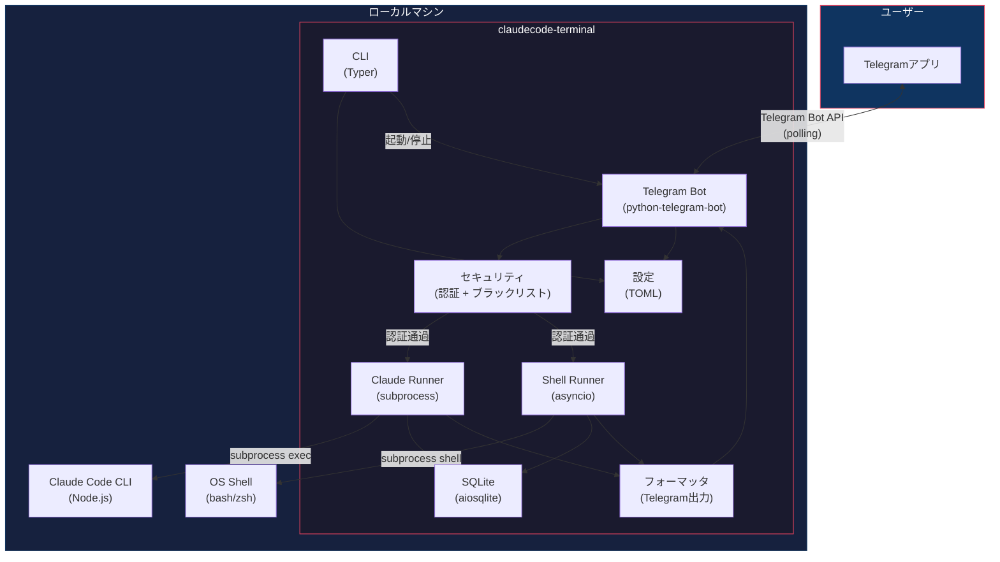
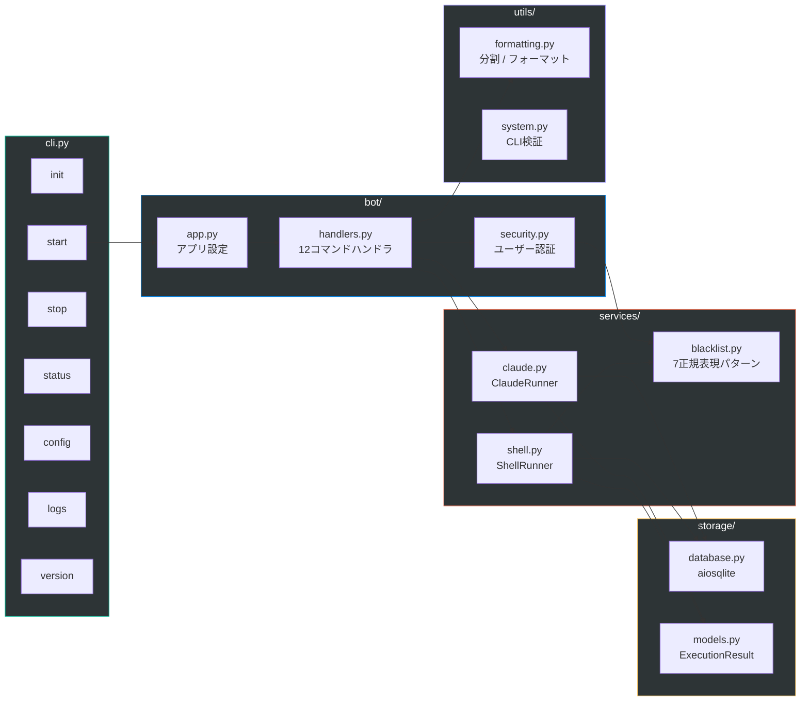
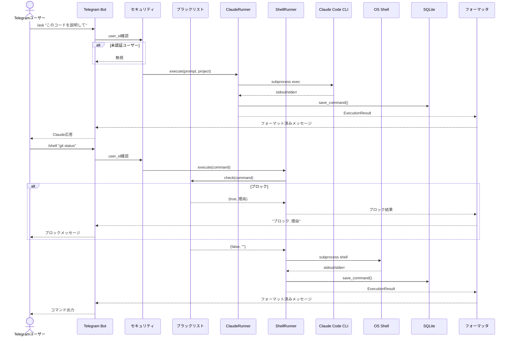
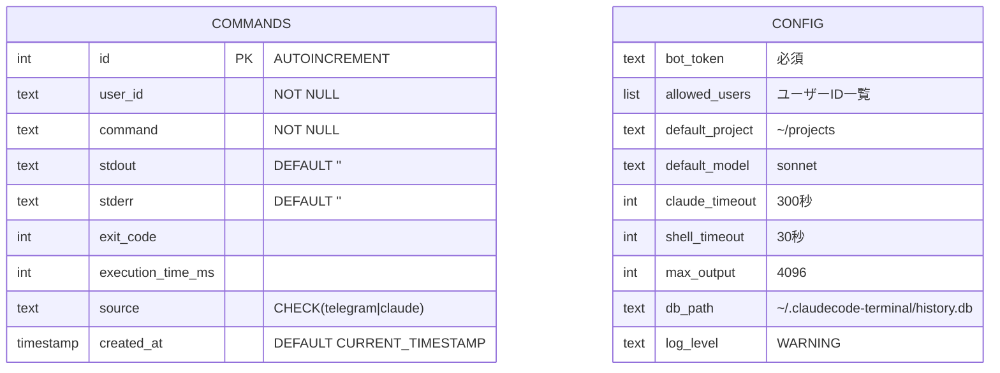
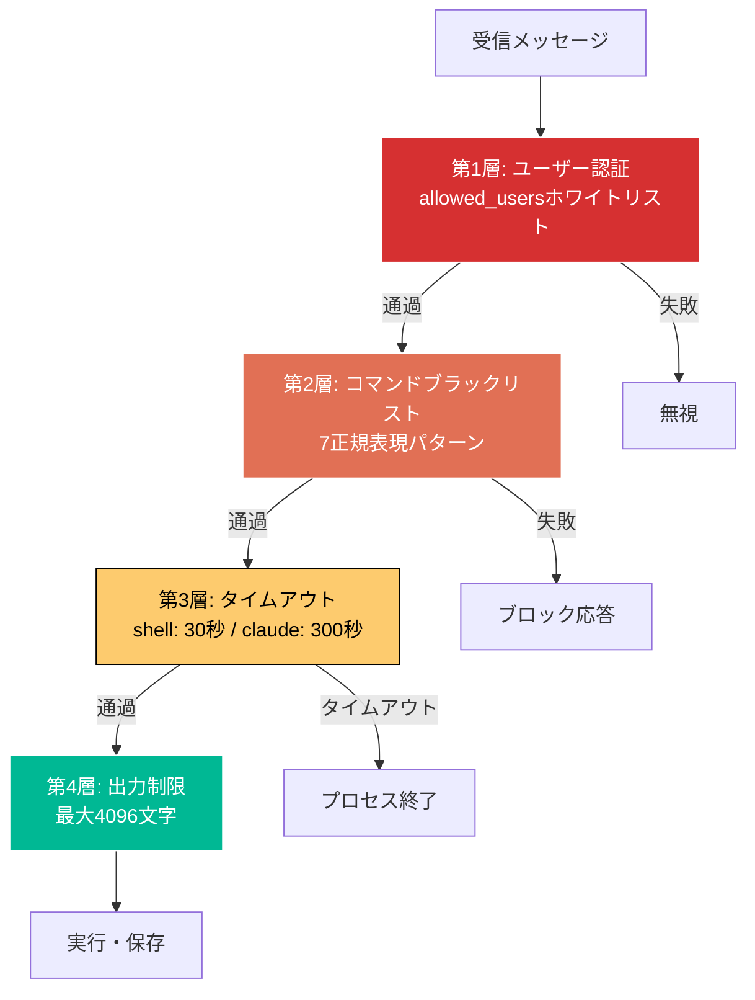

# ClaudeCode Terminal

> Telegramを通じてClaude Codeをリモート制御します。

[](https://python.org)
[](../LICENSE)
[](#docker統合テスト)

[English](../README.md) | [한국어](README.ko.md) | **[日本語](README.ja.md)** | [中文](README.zh.md)

---

## アーキテクチャ

### システム全体構成図



### モジュール構造



### リクエストフロー



### データモデル



### セキュリティ層



---

## 概要

ClaudeCode Terminalは、Telegramを通じて[Claude Code](https://docs.anthropic.com/en/docs/claude-code)をリモート制御する個人用CLIツールです。どこからでもTelegramボットでプロンプト送信、シェルコマンド実行、プロジェクト管理が可能です。

## 主な機能

- **Claude Code連携** - TelegramからClaude Codeにプロンプトを送信し結果を受信
- **リモートシェル** - Telegramでローカルマシンのシェルコマンドを実行
- **セキュリティ** - ユーザーIDホワイトリスト、危険コマンドブラックリスト、実行タイムアウト
- **デーモンモード** - バックグラウンドでボットを実行
- **コマンド履歴** - すべての実行記録をSQLiteに保存
- **マルチモデル** - Opus、Sonnet、Haikuモデルの切り替え

## 前提条件

- Python 3.10+
- [Claude Code CLI](https://docs.anthropic.com/en/docs/claude-code) (`npm i -g @anthropic-ai/claude-code`)
- Telegram Botトークン ([@BotFather](https://t.me/BotFather)で作成)

## インストール

```bash
pip install claudecode-terminal
```

## クイックスタート

```bash
# 対話型セットアップウィザード
claudecode-terminal init

# ボット起動（フォアグラウンド）
claudecode-terminal start

# バックグラウンド実行
claudecode-terminal start --daemon

# ステータス確認
claudecode-terminal status

# ボット停止
claudecode-terminal stop
```

## Telegramコマンド

| コマンド | 説明 |
|----------|------|
| `/ask <プロンプト>` | Claude Codeに質問 |
| `/shell <コマンド>` | シェルコマンドを実行 |
| `/project <パス>` | プロジェクトディレクトリを切替 |
| `/model <名前>` | モデル変更 (opus/sonnet/haiku) |
| `/continue [メッセージ]` | 前回の会話を続行 |
| `/system <プロンプト>` | システムプロンプトを設定 |
| `/maxturns <数>` | 最大会話ターン数を設定 |
| `/history` | 最近のコマンド履歴を表示 |
| `/settings` | 現在の設定を表示 |

テキストを入力すると、Claude Codeに直接送信されます。

## CLIコマンド

```bash
claudecode-terminal init      # 対話型セットアップウィザード
claudecode-terminal start     # ボット起動（フォアグラウンド）
claudecode-terminal start -d  # バックグラウンド実行
claudecode-terminal stop      # ボット停止
claudecode-terminal status    # 実行状態確認
claudecode-terminal config    # 設定の表示/変更
claudecode-terminal logs      # ボットログを表示
claudecode-terminal version   # バージョン情報
```

短縮コマンド: `claudecode-terminal`の代わりに`cct`が使用可能。

## 設定

設定ファイル: `~/.claudecode-terminal/config.toml`

環境変数は設定ファイルの値より優先されます:

| 環境変数 | 説明 | デフォルト |
|----------|------|-----------|
| `CLAUDECODE_BOT_TOKEN` | Telegram Botトークン | (必須) |
| `CLAUDECODE_ALLOWED_USERS` | カンマ区切りユーザーID | (全員許可) |
| `CLAUDECODE_DEFAULT_PROJECT` | デフォルトプロジェクトディレクトリ | `~/projects` |
| `CLAUDECODE_DEFAULT_MODEL` | デフォルトClaudeモデル | `sonnet` |
| `CLAUDECODE_TIMEOUT` | Claudeタイムアウト（秒） | `300` |
| `CLAUDECODE_SHELL_TIMEOUT` | シェルタイムアウト（秒） | `30` |
| `CLAUDECODE_MAX_OUTPUT` | 最大出力文字数 | `4096` |

## セキュリティ

- **ユーザー認証**: ホワイトリストに登録されたTelegramユーザーIDのみ許可
- **コマンドブラックリスト**: 危険なコマンドをブロック (rm -rf /、フォークボム、mkfs、dd、shutdown、対話型コマンド)
- **タイムアウト**: すべてのコマンドに実行時間制限を適用
- **出力制限**: メモリ問題を防ぐための出力長制限
- **設定ファイル権限**: `600`権限で保存

## Docker統合テスト

```bash
docker compose -f docker-compose.test.yml build
docker compose -f docker-compose.test.yml run --rm test
```

## ライセンス

MIT
