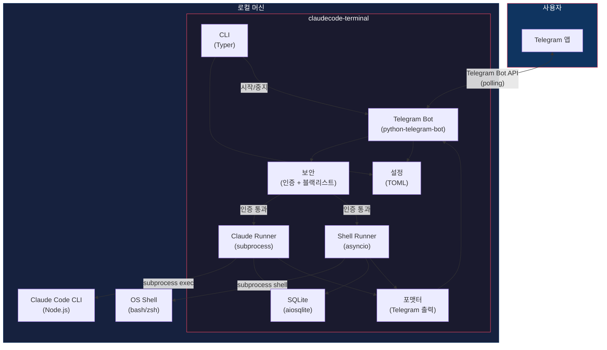
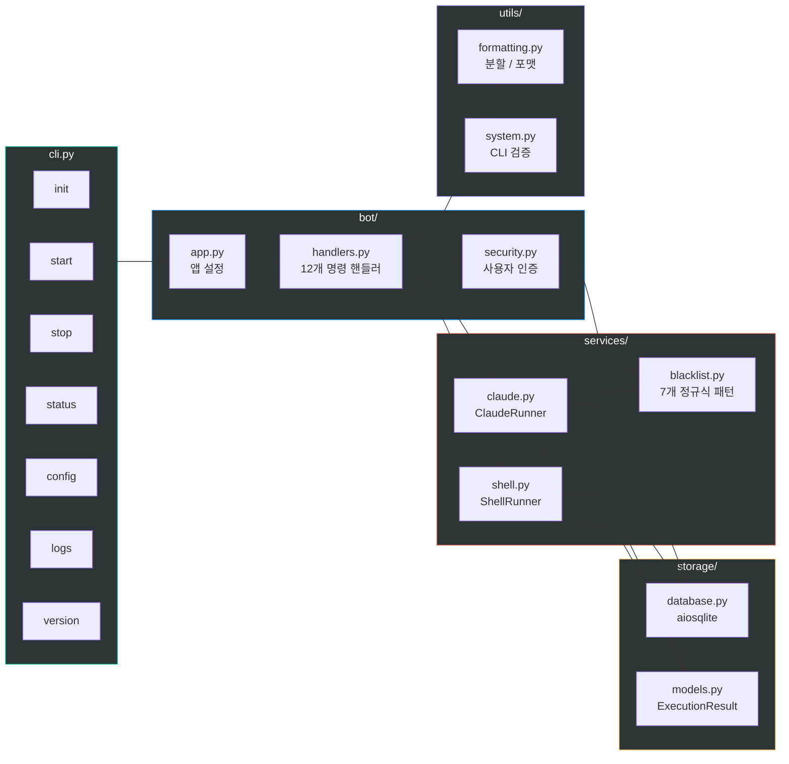
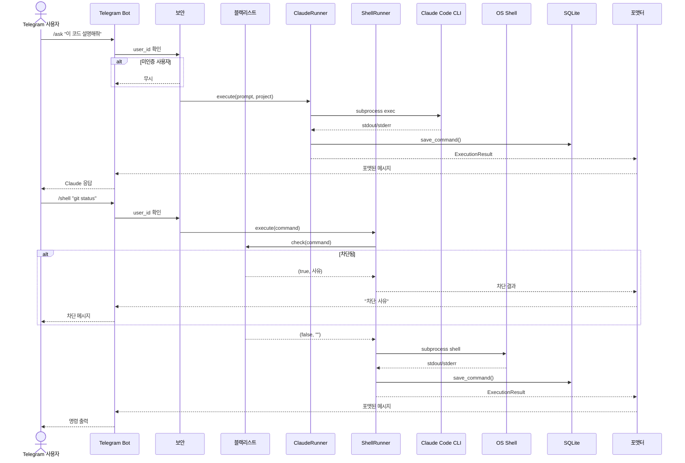
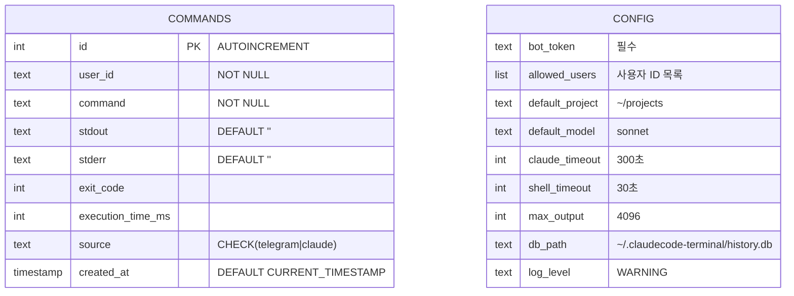
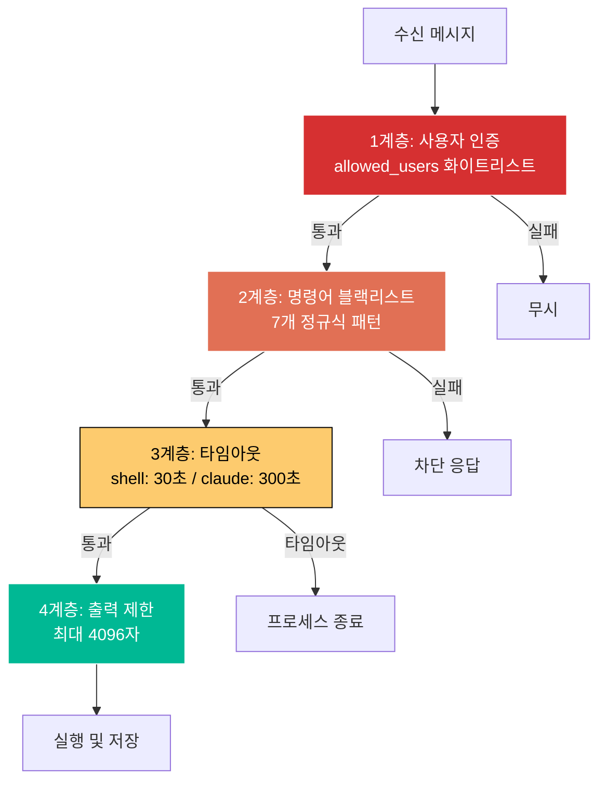

# ClaudeCode Terminal

> Telegram을 통해 Claude Code를 원격 제어합니다.

[](https://python.org)
[](../LICENSE)
[](#docker-통합-테스트)

[English](../README.md) | **[한국어](README.ko.md)** | [日本語](README.ja.md) | [中文](README.zh.md)

---

## 아키텍처

### 시스템 전체 구성도



### 모듈 구조



### 요청 흐름



### 데이터 모델



### 보안 계층



---

## 개요

ClaudeCode Terminal은 Telegram을 통해 [Claude Code](https://docs.anthropic.com/en/docs/claude-code)를 원격으로 제어하는 개인용 CLI 도구입니다. 어디서든 Telegram 봇으로 프롬프트 전송, 쉘 명령 실행, 프로젝트 관리가 가능합니다.

## 주요 기능

- **Claude Code 연동** - Telegram에서 Claude Code에 프롬프트를 보내고 결과를 받음
- **원격 쉘** - Telegram으로 로컬 머신에 쉘 명령어 실행
- **보안** - 사용자 ID 화이트리스트, 위험 명령어 블랙리스트, 실행 타임아웃
- **데몬 모드** - 백그라운드에서 봇 실행
- **명령어 이력** - 모든 실행 기록을 SQLite에 저장
- **멀티 모델** - Opus, Sonnet, Haiku 모델 전환

## 사전 요구사항

- Python 3.10+
- [Claude Code CLI](https://docs.anthropic.com/en/docs/claude-code) (`npm i -g @anthropic-ai/claude-code`)
- Telegram Bot 토큰 ([@BotFather](https://t.me/BotFather)에서 생성)

## 설치

```bash
pip install claudecode-terminal
```

## 빠른 시작

```bash
# 대화형 설정 마법사
claudecode-terminal init

# 봇 시작 (포그라운드)
claudecode-terminal start

# 백그라운드 실행
claudecode-terminal start --daemon

# 상태 확인
claudecode-terminal status

# 봇 중지
claudecode-terminal stop
```

## Telegram 명령어

| 명령어 | 설명 |
|--------|------|
| `/ask <프롬프트>` | Claude Code에 질문 |
| `/shell <명령어>` | 쉘 명령어 실행 |
| `/project <경로>` | 프로젝트 디렉토리 전환 |
| `/model <이름>` | 모델 변경 (opus/sonnet/haiku) |
| `/continue [메시지]` | 이전 대화 계속 |
| `/system <프롬프트>` | 시스템 프롬프트 설정 |
| `/maxturns <숫자>` | 최대 대화 턴 설정 |
| `/history` | 최근 명령어 이력 보기 |
| `/settings` | 현재 설정 보기 |

일반 텍스트를 입력하면 Claude Code로 직접 전송됩니다.

## CLI 명령어

```bash
claudecode-terminal init      # 대화형 설정 마법사
claudecode-terminal start     # 봇 시작 (포그라운드)
claudecode-terminal start -d  # 백그라운드 실행
claudecode-terminal stop      # 봇 중지
claudecode-terminal status    # 실행 상태 확인
claudecode-terminal config    # 설정 조회/수정
claudecode-terminal logs      # 봇 로그 보기
claudecode-terminal version   # 버전 정보
```

단축 명령: `claudecode-terminal` 대신 `cct` 사용 가능.

## 설정

설정 파일 위치: `~/.claudecode-terminal/config.toml`

환경변수가 설정 파일 값보다 우선 적용됩니다:

| 환경변수 | 설명 | 기본값 |
|----------|------|--------|
| `CLAUDECODE_BOT_TOKEN` | Telegram Bot 토큰 | (필수) |
| `CLAUDECODE_ALLOWED_USERS` | 쉼표 구분 사용자 ID | (전체 허용) |
| `CLAUDECODE_DEFAULT_PROJECT` | 기본 프로젝트 디렉토리 | `~/projects` |
| `CLAUDECODE_DEFAULT_MODEL` | 기본 Claude 모델 | `sonnet` |
| `CLAUDECODE_TIMEOUT` | Claude 타임아웃 (초) | `300` |
| `CLAUDECODE_SHELL_TIMEOUT` | 쉘 타임아웃 (초) | `30` |
| `CLAUDECODE_MAX_OUTPUT` | 최대 출력 문자수 | `4096` |

## 보안

- **사용자 인증**: 화이트리스트에 등록된 Telegram 사용자 ID만 허용
- **명령어 블랙리스트**: 위험 명령어 차단 (rm -rf /, fork bomb, mkfs, dd, shutdown, 대화형 명령)
- **타임아웃**: 모든 명령어에 실행 시간 제한 적용
- **출력 제한**: 메모리 문제 방지를 위한 출력 길이 제한
- **설정 파일 권한**: `600` 권한으로 저장

## Docker 통합 테스트

```bash
docker compose -f docker-compose.test.yml build
docker compose -f docker-compose.test.yml run --rm test
```

## 라이선스

MIT
