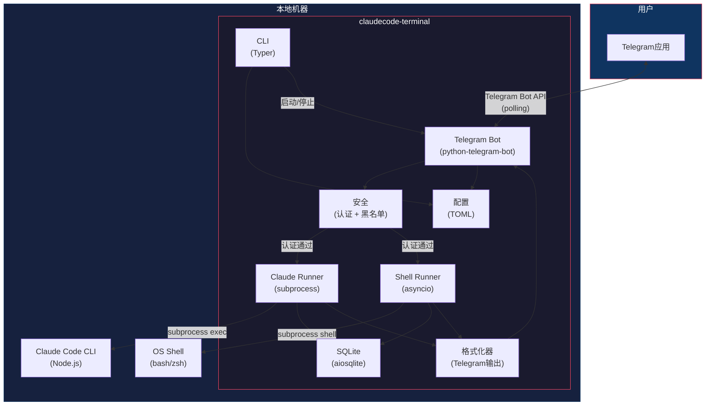
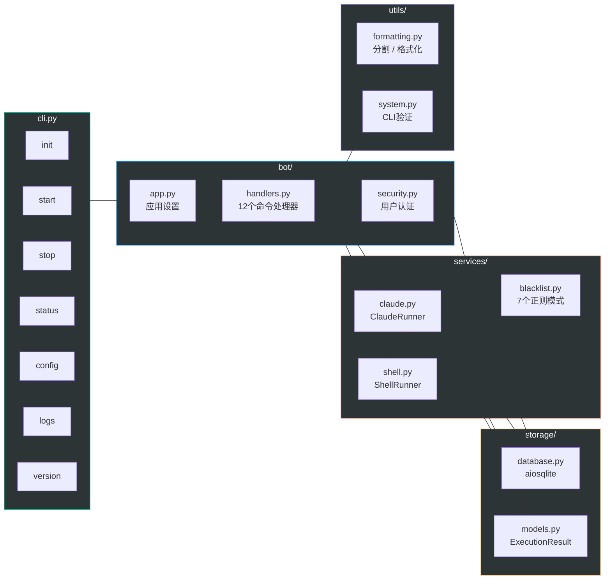
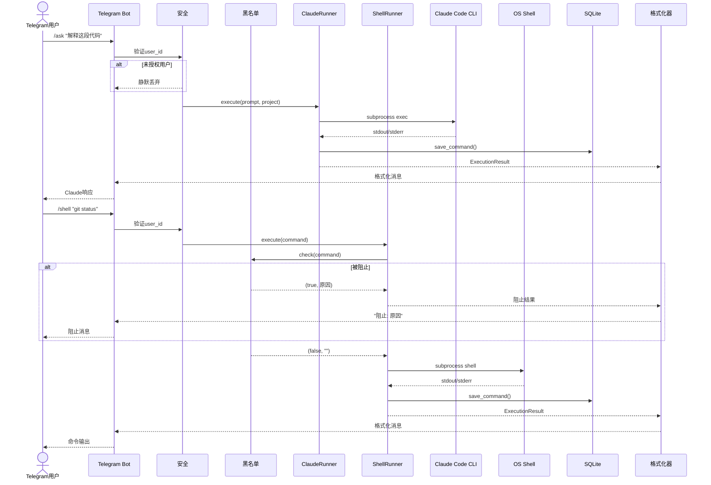
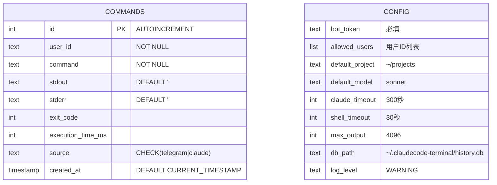
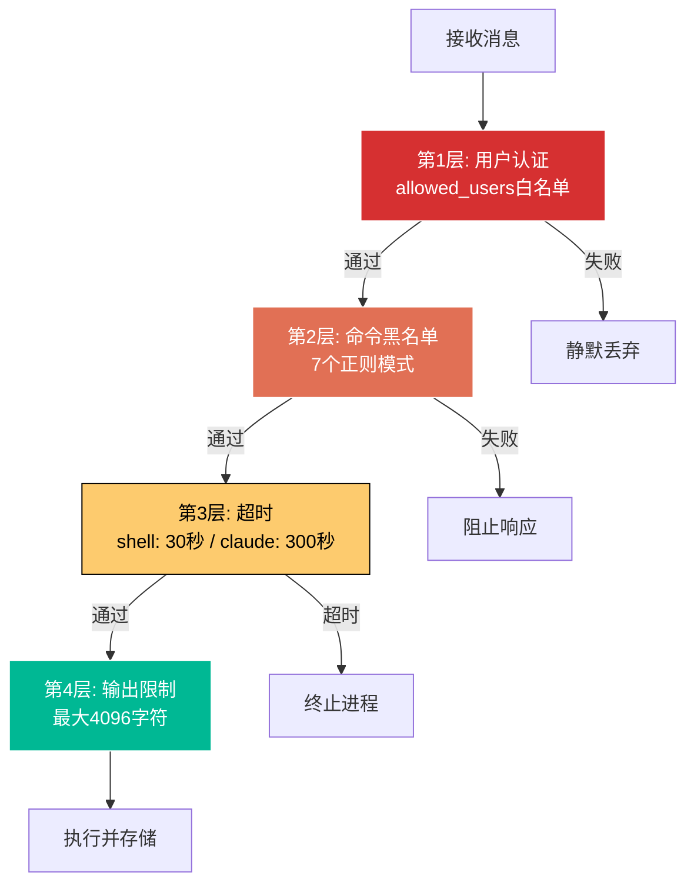

# ClaudeCode Terminal

> 通过Telegram远程控制Claude Code。

[](https://python.org)
[](../LICENSE)
[](#docker集成测试)

[English](../README.md) | [한국어](README.ko.md) | [日本語](README.ja.md) | **[中文](README.zh.md)**

---

## 架构

### 系统整体架构图



### 模块结构



### 请求流程



### 数据模型



### 安全层



---

## 概述

ClaudeCode Terminal是一个通过Telegram远程控制[Claude Code](https://docs.anthropic.com/en/docs/claude-code)的个人CLI工具。可以在任何地方通过Telegram机器人发送提示词、执行Shell命令、管理项目。

## 主要功能

- **Claude Code集成** - 通过Telegram向Claude Code发送提示词并接收结果
- **远程Shell** - 通过Telegram在本地机器上执行Shell命令
- **安全性** - 用户ID白名单、危险命令黑名单、执行超时
- **守护进程模式** - 在后台运行机器人
- **命令历史** - 所有执行记录保存到SQLite
- **多模型** - 在Opus、Sonnet、Haiku模型之间切换

## 前提条件

- Python 3.10+
- [Claude Code CLI](https://docs.anthropic.com/en/docs/claude-code) (`npm i -g @anthropic-ai/claude-code`)
- Telegram Bot令牌 (在[@BotFather](https://t.me/BotFather)创建)

## 安装

```bash
pip install claudecode-terminal
```

## 快速开始

```bash
# 交互式设置向导
claudecode-terminal init

# 启动机器人（前台）
claudecode-terminal start

# 后台运行
claudecode-terminal start --daemon

# 检查状态
claudecode-terminal status

# 停止机器人
claudecode-terminal stop
```

## Telegram命令

| 命令 | 说明 |
|------|------|
| `/ask <提示词>` | 向Claude Code提问 |
| `/shell <命令>` | 执行Shell命令 |
| `/project <路径>` | 切换项目目录 |
| `/model <名称>` | 更改模型 (opus/sonnet/haiku) |
| `/continue [消息]` | 继续上一次对话 |
| `/system <提示词>` | 设置系统提示词 |
| `/maxturns <数字>` | 设置最大对话轮数 |
| `/history` | 查看最近命令历史 |
| `/settings` | 查看当前设置 |

直接输入文本即可发送给Claude Code。

## CLI命令

```bash
claudecode-terminal init      # 交互式设置向导
claudecode-terminal start     # 启动机器人（前台）
claudecode-terminal start -d  # 后台运行
claudecode-terminal stop      # 停止机器人
claudecode-terminal status    # 检查运行状态
claudecode-terminal config    # 查看/修改配置
claudecode-terminal logs      # 查看机器人日志
claudecode-terminal version   # 显示版本信息
```

快捷命令: 可以使用`cct`代替`claudecode-terminal`。

## 配置

配置文件位置: `~/.claudecode-terminal/config.toml`

环境变量优先于配置文件:

| 环境变量 | 说明 | 默认值 |
|----------|------|--------|
| `CLAUDECODE_BOT_TOKEN` | Telegram Bot令牌 | (必填) |
| `CLAUDECODE_ALLOWED_USERS` | 逗号分隔的用户ID | (允许所有) |
| `CLAUDECODE_DEFAULT_PROJECT` | 默认项目目录 | `~/projects` |
| `CLAUDECODE_DEFAULT_MODEL` | 默认Claude模型 | `sonnet` |
| `CLAUDECODE_TIMEOUT` | Claude超时（秒） | `300` |
| `CLAUDECODE_SHELL_TIMEOUT` | Shell超时（秒） | `30` |
| `CLAUDECODE_MAX_OUTPUT` | 最大输出字符数 | `4096` |

## 安全性

- **用户认证**: 仅允许白名单中的Telegram用户ID
- **命令黑名单**: 阻止危险命令 (rm -rf /、fork bomb、mkfs、dd、shutdown、交互式命令)
- **超时**: 所有命令都有可配置的执行时间限制
- **输出限制**: 限制输出长度以防止内存问题
- **配置文件权限**: 以`600`权限保存

## Docker集成测试

```bash
docker compose -f docker-compose.test.yml build
docker compose -f docker-compose.test.yml run --rm test
```

## 许可证

MIT
